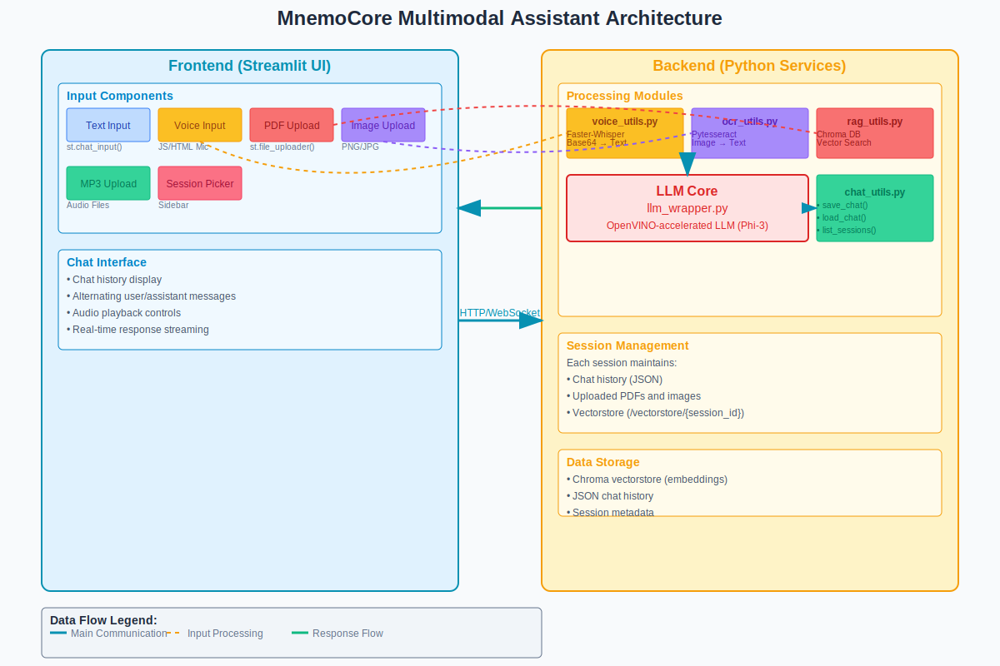
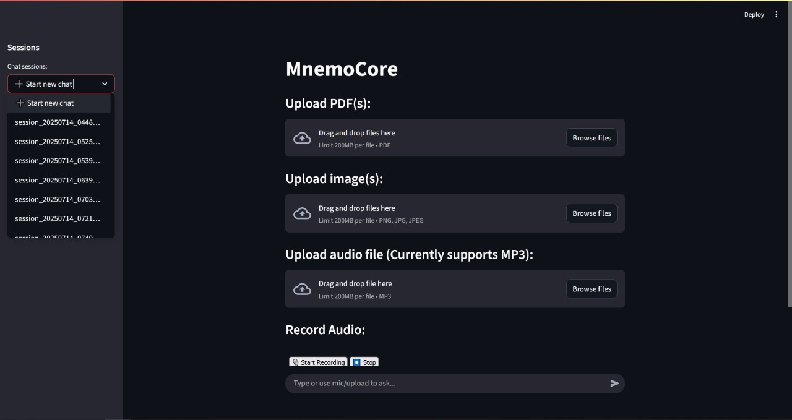
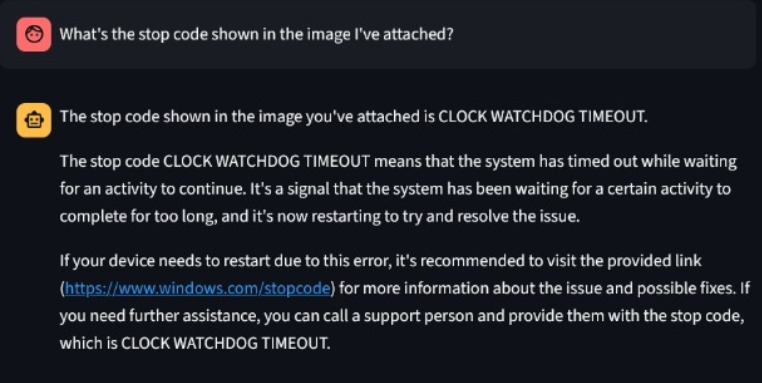
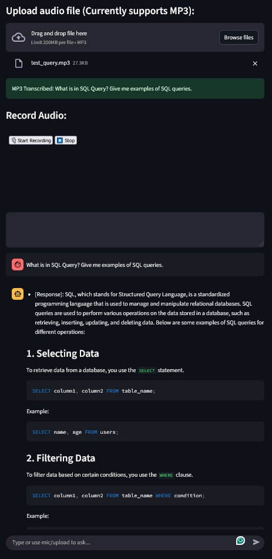
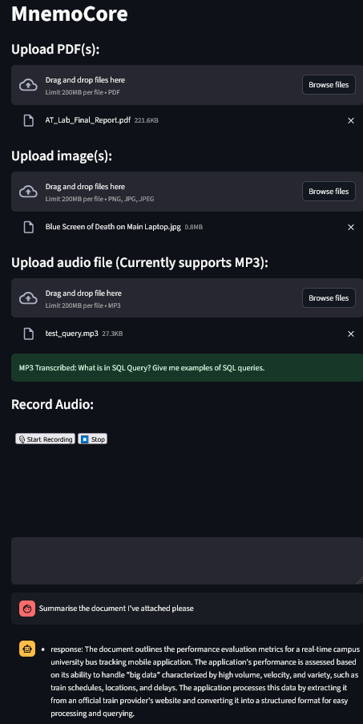
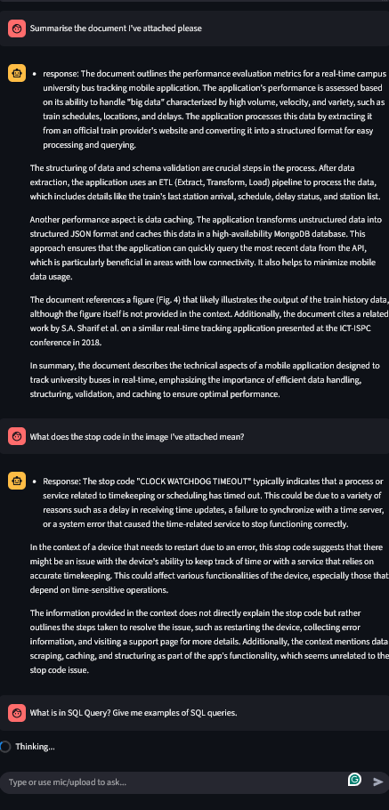
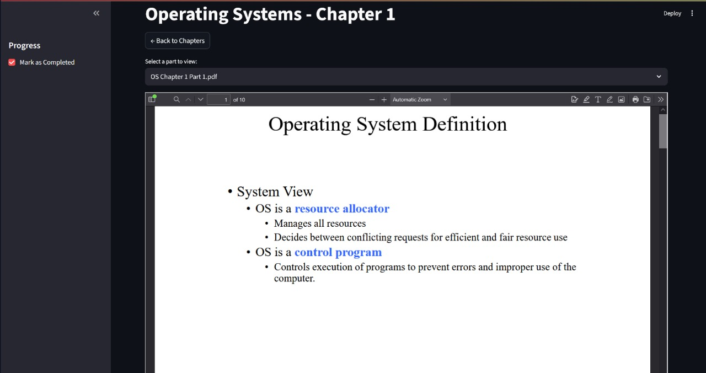
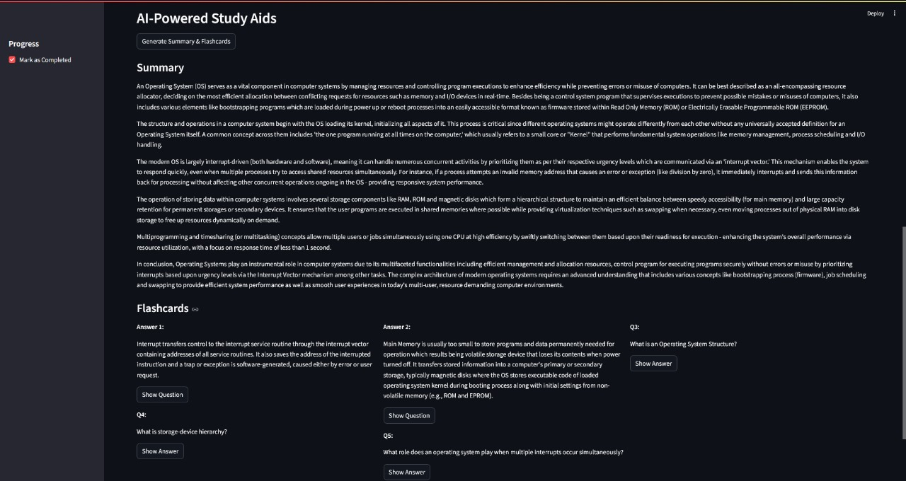
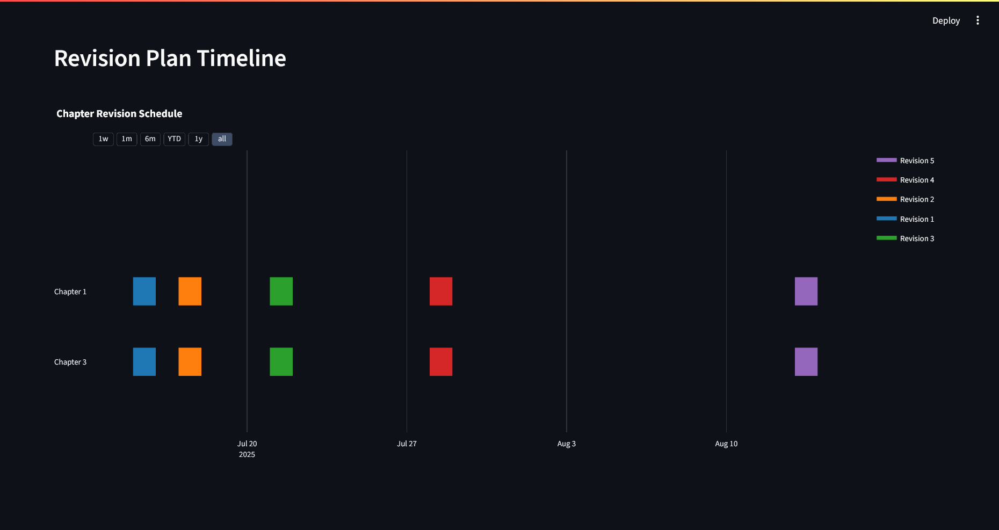
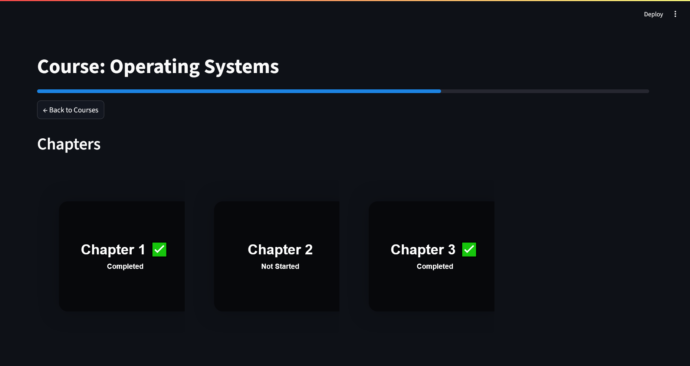

# Intel Unnati Industrial Training Program 2025

## Problem Statement 4: AI-Powered Interactive Learning Assistant for Classrooms

### Objective
Build a Multimodal AI assistant for classrooms to dynamically answer queries using text,
voice, and visuals while improving student engagement with personalized responses.

## Project Overview:

### This project consists of two components:

### 1.  MnemoCore Course Companion:   
  ### Features:
- **Course and Chapter Navigation:** Easily browse through your courses and their respective chapters.
- **PDF Viewer:** View chapter content directly in the app.
- **Progress Tracking:** Mark chapters as complete and visualize your study progress.
- **Revision Timeline:** Get a personalized revision schedule based on spaced repetition principles.
- **AI-Powered Flashcards:** Generate flashcards from your course material to aid in studying (requires an OpenAI API key).

### 2.  MnemoCore, an interactive chatbot:
  ### Features:

- **Multimodal Input Processing** - Unified interface for text, voice (WebM/MP3), PDF documents, and image OCR via Streamlit
- **Speech Recognition** - Faster-Whisper integration for real-time transcription with base64 audio handling
- **RAG Implementation** - Chroma vectorstore with sentence-transformers for semantic PDF document retrieval
- **OpenVINO Acceleration** - Local Phi-3 model inference with hardware optimization for privacy and performance
- **Session Architecture** - Persistent JSON chat history with session-specific vectorstores and context retention
- **Real-time Processing Pipeline** - Asynchronous multimodal input handling with dynamic context injection and response streaming

## Architecture Diagram 


## Methodology:
Methodology

The implementation of MnemoCore follows a modular, multimodal AI system architecture:
1. Input Modality Handling

    Text Input: Natural text queries are entered via a chat interface and processed by an OpenVINO-optimized local LLM.

    Voice Input: Speech-to-text conversion is powered by the Whisper model (via faster-whisper), triggered by a built-in voice recorder UI.

    Image Input:

        For diagrams/photos: Image captioning using OpenVINO-converted BLIP.

        For scanned notes/textbooks: OCR with Tesseract to extract relevant text.

    Document Upload: Users can upload PDFs which are indexed per session using Chroma and LangChain’s retriever pipeline.

2. Contextual Understanding

    RAG (Retrieval-Augmented Generation) is used to fetch relevant content from pre-ingested documents and user-uploaded PDFs.

    If the retrieved context is relevant (not empty or noisy), it is injected into the prompt for accurate, contextual responses.

3. Response Generation

    The response is generated using a quantized LLM (OpenVINO-optimized), and may include:

        Textual explanations

        Chart generation (e.g., via matplotlib if needed)

        Summaries of visual or document input

4. Session Memory

    Each conversation is stored in a persistent, session-specific memory.

    Uploaded files and generated responses are isolated per session to enable personalized interactions.

5. Optimization for Intel Hardware

    OpenVINO backend is used to run the LLM and image models efficiently on CPU (tested on i7-8550U, 8GB RAM).

    Models are quantized to INT8 or FP16 as needed for faster inference.

## Tech Stack
### MnemoCore Chatbot:

| Component           | Technology Used                          |
|---------------------|-------------------------------------------|
| UI Framework        | Streamlit                                 |
| Language Model      | OpenVINO-optimized LLM (Phi-3-Mini-128k) |
| RAG Framework       | LangChain + Chroma vectorstore            |
| PDF Processing      | PyMuPDF / PyPDFLoader                     |
| Image Understanding | Tesseract OCR via `pytesseract`           |
| Voice Input         | Whisper (via `faster-whisper`)            |
| File Handling       | `pdfplumber`, `Pillow`                    |
| Speech Transcription| Microphone + MP3 upload                   |
| State Management    | Streamlit session state + JSON logs       |
| Inference Runtime   | Intel OpenVINO for accelerated CPU use    | 

### MnemoCore Course Companion:

| Component          | Technology Used                                    |
| ------------------ | -------------------------------------------------- |
| UI Framework       | Streamlit                                          |
| Language Model     | Phi 3 Mini, Ollama                                 |
| PDF Processing     | PyMuPDF                                            |
| Data Visualization | Plotly                                             |
| State Management   | Streamlit Session State                            

---
## Screenshots:
### MnemoCore Chatbot

----------------------------------------

---------------------------------------

---------------------------------------

---------------------------------------

---------------------------------------
### MnemoCore Course Companion

---------------------------------------------------------

---------------------------------------------------------

---------------------------------------------------------

---------------------------------------------------------

## Demo Videos:  
Note:
The inference times in the demo videos here are slow-**upwards of 2-3 minutes on average**. This is because the system I currently have with me for testing is a **7-year old laptop with 8GB of RAM and no GPU**, and as such is not very performant.  


### MnemoCore Course Companion:   https://youtu.be/sjx1kb9Jvbs    

### MnemoCore Assistant Part 1:   https://youtu.be/3Gyc1SHJx_w
### MnemoCore Assistant Part 2:   https://youtu.be/lPkAdUeulIs
### MnemoCore Assistant Part 3:   https://youtu.be/84NxpD5FUWw

## Setup and Installation

### Prerequisites:
1. Python ≥ 3.9
2. pip ≥ 22.0
3. Git
4. Tesseract OCR 
   > Install from: https://github.com/tesseract-ocr/tesseract
    Add to PATH or specify path in ocr_utils.py if needed
5.  FFmpeg (for audio decoding)
6. OpenVINO Runtime (installed automatically via optimum-intel)

### Create Virtual Environment:
```bash
python -m venv venv
source venv/bin/activate      # Windows: venv\Scripts\activate
```
### Install Dependencies:
```bash 
pip install -r requirements.txt
```
### Clone the Repository

```bash
git clone https://github.com/kafkaEsc-04/Intel-Unnati-AI-Powered-Learning-Assistant-.git
```

### Expected Directory Setup for MnemoCore Chatbot
```pgsql
Your-Directory-/
├── app.py
├── llm_wrapper.py
├── rag_utils.py
├── voice_utils.py
├── voice_ui.py
├── ocr_utils.py
├── chat_utils.py
├── test_whisper_transcription.py
├── requirements.txt
├── vectorstore/
│   └── <chat_session_id>.json
├── chat_logs
└── README.md
```
### Expected Directory Setup for MnemoCore Course Companion
```pgsql
Your-Directory-/
├── Course Material/
│   └── [Your Course Name]/
│       └── [Your Chapter Name]/
│           └── [your_file].pdf
├── streamlit_lms.py
```
### Run the apps
#### For Chatbot
``` bash
streamlit run app.py
```
#### For Course Companion
``` bash
streamlit run streamlit_lms.py
```
----
## Future Improvements:


### Short-Term Objectives

#### 1. **Multilingual Query Support**
- Integrate Whisper large model (CPU-optimized) for Indian language transcription.
- Add IndicNLP or AI4Bharat embeddings for context-aware RAG in Hindi and other regional languages.

#### 2. **Improved PDF Chunking + Metadata-Aware Retrieval**
- Implement semantic chunking using sentence boundaries and headings.
- Tag document chunks with metadata (e.g., subject, topic) for scoped search and filtered retrieval.

#### 3. **Model Caching & Session Performance Optimization**
- Add persistent session-level caching for:
  - Retrieved chunks (via LangChain's retriever cache)
  - Tokenized inputs for repeated prompts
- Reduce redundant inference overhead in long sessions.

---
### Longer-Term Implementation

#### 1. **Facial Emotion-Based Engagement Detection**
- Integrate OpenCV + `FER` or `DeepFace` models to detect:
  - Disengagement
  - Confusion or boredom
- Use feedback loop to alter explanation style or slow down delivery.

#### 2. **Adaptive Teaching Assistant Loop**
- Track query success rate, user feedback score, and query categories.
- Implement RLHF-like feedback system to prioritize:
  - Easier analogies for weak topics
  - More examples for high-error categories

#### 3. **Curriculum Alignment**
- Create modular curriculum packs per grade level (K-12 or university courses).
- Include topic classification models for automatic alignment with uploaded PDFs.

#### 4. **Teacher Analytics Dashboard**
- Backend:
  - Store chat metadata, session usage logs, and topic frequency in a lightweight SQLite or NoSQL DB.
- Frontend:
  - Display heatmaps for common student doubts
  - Material upload interface with tagging and bulk ingestion

#### 5. **Edge-Optimized Multimodal Pipeline**
- Quantize OCR + captioning + LLM models using NNCF or OpenVINO INT8 pipelines.
- Integrate Intel NPU (if available) and test power-efficiency vs CPU fallback.

------
## Credits
Built by Sai Rithvik Nama with aid and guidance from Mrs. Vibha Prabhu and Mr. Debdyut Hajra.

## Acknowledgements
1. [Intel OpenVino](https://www.intel.com/content/www/us/en/developer/tools/openvino-toolkit/overview.html)  
2. [Hugging Face](https://huggingface.co/)  
3. [Tesseract OCR](github.com/tesseract-ocr/tesseract)
4. [LangChain](https://github.com/langchain-ai/langchain)

